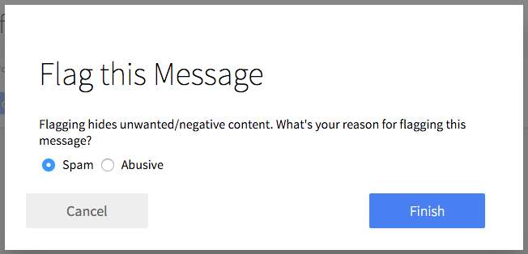

# Form: Flag Msg

Flag messages (modal form).



```jsx
import ModalBtn from 'patchkit-modal/btn'
import FormFlagMsg from 'patchkit-form-flag-msg'

const onSubmit = (reason, cb) => { console.log('submit', reason); cb() }
<ModalBtn className="center-block" Form={FormFlagMsg} formProps={{onSubmit: onSubmit}}>
  <a className="btn highlighted">Click to open</a>
</ModalBtn>
```